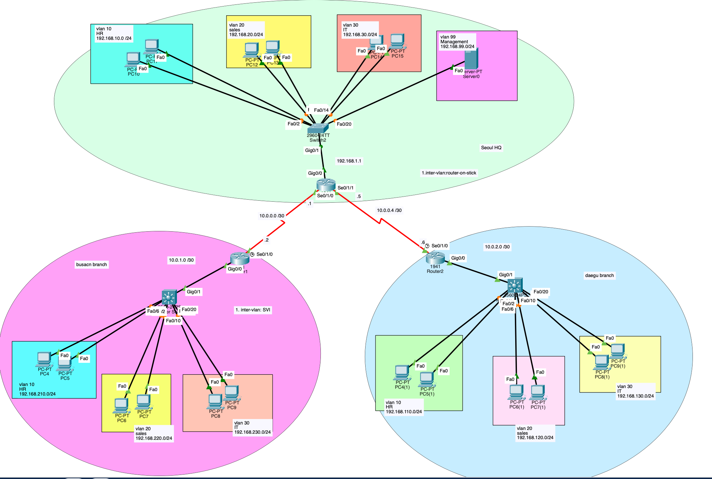

# Multi-Site Enterprise Network with VLANs and OSPF

A Cisco Packet Tracer project simulating a 3-site enterprise network (Seoul HQ, Busan Branch, Daegu Branch) with VLAN segmentation, two different inter-VLAN routing methods, centralized DHCP, OSPF routing between sites, and Layer 2 security hardening.

## Table of Contents

1. [Overview](#1-overview)
2. [Network Topology](#2-network-topology)
3. [VLAN Table](#3-vlan-table)
4. [IP Addressing Scheme](#4-ip-addressing-scheme)
5. [Implementation](#5-implementation)
   - [5.1 Seoul HQ](#51-seoul-hq)
   - [5.2 Busan Branch](#52-busan-branch)
   - [5.3 Daegu Branch](#53-daegu-branch)
6. [Routing (OSPF)](#6-routing-ospf)
7. [DHCP](#7-dhcp)
8. [Layer 2 Security](#8-layer-2-security)
9. [Known Limitations](#9-known-limitations)
10. [Files](#10-files)

## 1. Overview

This project demonstrates a small multi-site enterprise network built in Cisco Packet Tracer. Each site is segmented into department-based VLANs (HR, Sales, IT, and a Management VLAN at HQ), with all three sites connected over point-to-point serial links and OSPF as the dynamic routing protocol. A centralized DHCP server at Seoul HQ provides IP addressing to all VLANs across all three sites via DHCP relay.

Two different inter-VLAN routing approaches are demonstrated intentionally:
- **Seoul HQ** uses a Layer 2 switch, so inter-VLAN routing is done via **Router-on-a-Stick** (subinterfaces on the router).
- **Busan** and **Daegu** branches use Layer 3 switches, so inter-VLAN routing is done via **SVIs (Switched Virtual Interfaces)** directly on the switch.

ACL configuration was intentionally left out of this project — it will be covered separately in a dedicated **NAT + ACL** project.

## 2. Network Topology

## 3. VLAN Table

| Site  | VLAN | Name       | Network          |
| ----- | ---- | ---------- | ---------------- |
| Seoul | 10   | HR         | 192.168.10.0/24  |
| Seoul | 20   | Sales      | 192.168.20.0/24  |
| Seoul | 30   | IT         | 192.168.30.0/24  |
| Seoul | 99   | Management | 192.168.99.0/24  |
| Busan | 10   | HR         | 192.168.210.0/24 |
| Busan | 20   | Sales      | 192.168.220.0/24 |
| Busan | 30   | IT         | 192.168.230.0/24 |
| Daegu | 10   | HR         | 192.168.110.0/24 |
| Daegu | 20   | Sales      | 192.168.120.0/24 |
| Daegu | 30   | IT         | 192.168.130.0/24 |

## 4. IP Addressing Scheme

### Point-to-Point (Serial) Links

| Link          | Network     | Seoul Side   | Remote Side           |
| ------------- | ----------- | ------------ | ---------------------- |
| Seoul ↔ Busan | 10.0.0.0/30 | .1 (Se0/1/0) | .2 (r1 Se0/1/0)        |
| Seoul ↔ Daegu | 10.0.0.4/30 | .5 (Se0/1/1) | .6 (Router2 Se0/1/0)   |

### Branch Router ↔ L3 Switch Uplinks

| Link                       | Network     |
| -------------------------- | ----------- |
| Busan r1 ↔ L3 Switch       | 10.0.1.0/30 |
| Daegu Router2 ↔ L3 Switch  | 10.0.2.0/30 |

## 5. Implementation

### 5.1 Seoul HQ

- **Switch2** (Layer 2 switch) — hosts VLANs 10 (HR), 20 (Sales), 30 (IT), and 99 (Management), where the DHCP server (`Server0`) lives.
- **Router** — connected to Switch2 via a trunk on Gig0/1, configured with subinterfaces for **Router-on-a-Stick** inter-VLAN routing. Also connects to Busan and Daegu over two serial links (Se0/1/0, Se0/1/1).

### 5.2 Busan Branch

- **L3 Switch** — hosts VLANs 10 (HR), 20 (Sales), 30 (IT), configured with **SVIs** for local inter-VLAN routing.
- **r1** — connects the branch to Seoul HQ over a serial link, and to the L3 switch via a routed Gig0/0–Gig0/1 uplink (10.0.1.0/30).

### 5.3 Daegu Branch

- **L3 Switch** — hosts VLANs 10 (HR), 20 (Sales), 30 (IT), configured with **SVIs** for local inter-VLAN routing.
- **Router2** — connects the branch to Seoul HQ over a serial link, and to the L3 switch via a routed Gig0/0–Gig0/1 uplink (10.0.2.0/30).

## 6. Routing (OSPF)

OSPF is configured between the three site routers (Seoul Router, Busan `r1`, Daegu `Router2`) to advertise all VLAN networks and the point-to-point links, providing full reachability between all three sites.

## 7. DHCP

A DHCP server is hosted in the Seoul Management VLAN (99). All VLANs across all three sites — including Busan and Daegu — receive their addressing from this central server via `ip helper-address` (DHCP relay) configured on each VLAN's gateway interface.

## 8. Layer 2 Security

| Site       | Port Security            | DHCP Snooping | Dynamic ARP Inspection (DAI) |
| ---------- | ------------------------- | -------------- | ------------------------------- |
| Seoul (L2) | ✅                         | ✅              | ✅ (trusted on uplink to router) |
| Busan (L3) | ✅ (violation: restrict)   | ❌ removed      | ❌ not applicable on L3          |
| Daegu (L3) | ✅ (violation: protect)    | ❌ removed      | ❌ not applicable on L3          |

DHCP Snooping and DAI are Layer 2 features tied to switchport/VLAN context, so they were only fully implemented at Seoul HQ (the L2 switch). On the Busan and Daegu L3 switches, DHCP Snooping was initially attempted but ended up removed — see [Known Limitations](#9-known-limitations) below.

## 9. Known Limitations

- **DHCP Snooping on L3 switches**: `ip dhcp snooping limit rate` only applies to Layer 2 switchport interfaces. An early attempt to apply it directly to a routed uplink (`no switchport` interface) failed with an `Invalid input` error. DHCP Snooping was ultimately removed from both branch L3 switches rather than reconfigured on the access ports.
- **DAI on L3 switches**: Dynamic ARP Inspection depends on the DHCP Snooping binding table and VLAN-level enforcement, so it was not implemented on the Busan/Daegu L3 switches.
- **No ACLs**: Traffic between VLANs and sites is currently unrestricted. ACL and NAT configuration is planned as a separate follow-up project.

## 10. Files

- `multi-site_enterprise_network_with_VLANs_and_OSPF.pkt` — Cisco Packet Tracer topology file
- `topology.png` — network topology diagram

## Tools

- Cisco Packet Tracer
